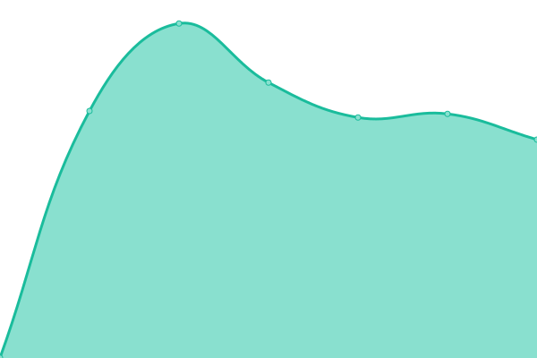
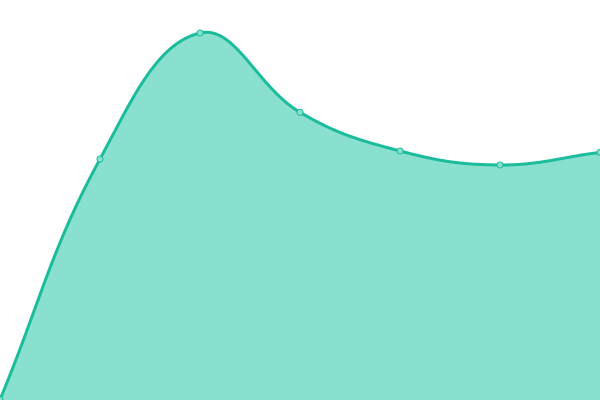
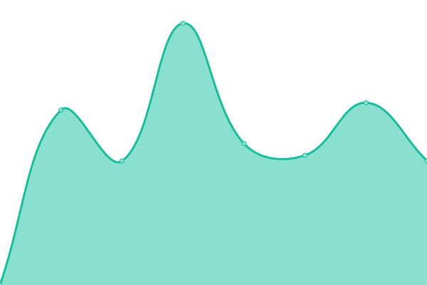

# [📈 Live Status](https://mai0li.github.io/status): <!--live status--> **🟧 Partial outage**

This repository contains the open-source uptime monitor and status page for [Pedro Maioli](https://mai0li.github.io/status), powered by [Upptime](https://github.com/upptime/upptime).

With [Upptime](https://upptime.js.org), you can get your own unlimited and free uptime monitor and status page, powered entirely by a GitHub repository. We use [Issues](https://github.com/mai0li/status/issues) as incident reports, [Actions](https://github.com/mai0li/status/actions) as uptime monitors, and [Pages](https://mai0li.github.io/status) for the status page.

<!--start: status pages-->
<!-- This summary is generated by Upptime (https://github.com/upptime/upptime) -->
<!-- Do not edit this manually, your changes will be overwritten -->
<!-- prettier-ignore -->
| URL | Status | History | Response Time | Uptime |
| --- | ------ | ------- | ------------- | ------ |
|  [Google](https://www.google.com) | 🟩 Up | [google.yml](https://github.com/mai0li/status/commits/HEAD/history/google.yml) | 

 101ms
     
 | 

<a href="https://mai0li.github.io/status/history/google">100.00%</a>
    

|  [B3 (Cotação)](http://www.b3.com.br/pt_br/market-data-e-indices/servicos-de-dados/market-data/cotacoes/) | 🟩 Up | [b3-cotacao.yml](https://github.com/mai0li/status/commits/HEAD/history/b3-cotacao.yml) | 

 1355ms
     
 | 

<a href="https://mai0li.github.io/status/history/b3-cotacao">100.00%</a>
    

|  [B3 (Negociação Diária)](http://www.b3.com.br/pt_br/market-data-e-indices/servicos-de-dados/market-data/historico/boletins-diarios/pesquisa-por-pregao/pesquisa-por-pregao/) | 🟩 Up | [b3-negociacao-diaria.yml](https://github.com/mai0li/status/commits/HEAD/history/b3-negociacao-diaria.yml) | 

 368ms
     
 | 

<a href="https://mai0li.github.io/status/history/b3-negociacao-diaria">100.00%</a>
    

|  [Tesouro SisWeb (HEAD request)](https://sisweb.tesouro.gov.br/apex/f?p=2501:9::::9:P9_ID_PUBLICACAO:28715) | 🟩 Up | [tesouro-sis-web-head-request.yml](https://github.com/mai0li/status/commits/HEAD/history/tesouro-sis-web-head-request.yml) | 

 1129ms
     
 | 

<a href="https://mai0li.github.io/status/history/tesouro-sis-web-head-request">100.00%</a>
    

|  [Banco Central (403)](https://www4.bcb.gov.br/pom/demab/negociacoes/) | 🟩 Up | [banco-central-403.yml](https://github.com/mai0li/status/commits/HEAD/history/banco-central-403.yml) | 

 1202ms
     
 | 

<a href="https://mai0li.github.io/status/history/banco-central-403">100.00%</a>
    

|  [Debentures SND](http://www.debentures.com.br/exploreosnd/consultaadados/eventosfinanceiros/pudeeventos_r.asp) | 🟥 Down | [debentures-snd.yml](https://github.com/mai0li/status/commits/HEAD/history/debentures-snd.yml) | 

 0ms
     
 | 

<a href="https://mai0li.github.io/status/history/debentures-snd">100.00%</a>
    

<!--end: status pages-->

[**Visit our status website →**](https://mai0li.github.io/status)

## 📄 License

- Powered by: [Upptime](https://github.com/upptime/upptime)
- Code: [MIT](./LICENSE) © [Pedro Maioli](https://mai0li.github.io/status)
- Data in the `./history` directory: [Open Database License](https://opendatacommons.org/licenses/odbl/1-0/)
